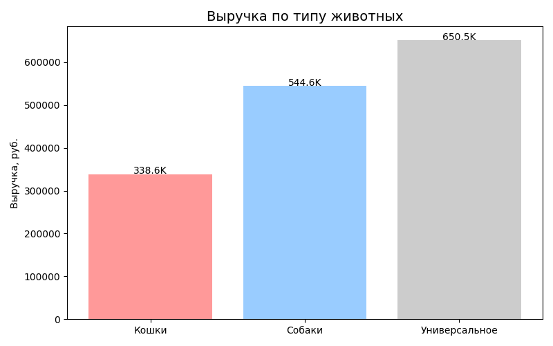
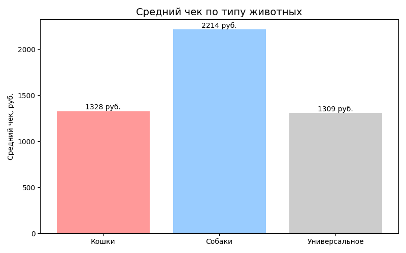

# Анализ продаж зоомагазина (Pet shop sales analysis)

# О проекте:

Это мой второй учебный проект по анализу данных! Решила за пример взять зоотовары.

# Что я хотела узнать

- Кто больше тратит - владельцы кошек или собак?

- Какие товары покупают чаще всего?

- Что покупают вместе? (чтобы потом делать рекомендации "с этим товаром часто берут")

Данные я сгенерировала сама (файл create_data.py), чтобы было похоже на реальный магазин.

# Что я использовала

- Python - язык программирования

- pandas - чтобы обрабатывать таблицы (считать сумму, среднее, группировать)

- matplotlib - чтобы рисовать графики

- Git/GitHub - чтобы хранить код и показывать его другим

# Графики и выводы

## 1. Кто приносит больше денег?

## 2. Средний чек: кошки vs собаки

## 3. Топ-10 товаров

## Лидеры продаж:

- Корма (сухие и влажные) - ожидаемо

- Наполнитель для туалета - куда без него

- Игрушки - тоже неплохо продаются

# Анализ корзин (что покупают вместе)

Это самая интересная часть! Я посмотрела, какие товары чаще всего встречаются в одном чеке.

## Топ-5 пар товаров:

- Корм для кошек (влажный) + Наполнитель для туалета

- Корм для собак (сухой) + Игрушка для собак 

- Лакомства + Игрушки - чтобы баловать

- Когтеточка + Корм для кошек 

- Шампунь + Расческа 

Это можно использовать для рекомендаций: "С этим товаром часто покупают..."

# Файлы в проекте

- create_data.py - скрипт, который создает данные о продажах

- pet_shop_analysis.py - основной анализ (считает метрики, строит графики)

- pet_reports/ - папка с отчетами и графиками (создается после запуска)

- pet_shop_report.xlsx — Excel-файл со всеми расчетами

# Как запустить у себя

1. Скачать данный репозиторий

2. Установить библиотеки:
    pip install pandas matplotlib openpyxl

3. Сгенерировать данные:
    python create_data.py

4. Запустить анализ:
    python pet_shop_analysis.py

5. Заглянуть в папку pet_reports/ — там графики и Excel-отчет

# Чему я научилась в этом проекте

- Работать с pandas - группировать данные, считать метрики, фильтровать

- Строить графики в matplotlib и сохранять их

- Делать анализ корзин (простой, но рабочий)

- Писать функции для обработки данных

- Сохранять результаты в Excel с несколькими листами

# Что можно улучшить (мои планы)

- Добавить анализ по месяцам (сезонность)

- Сделать предсказание продаж на следующую неделю

- Написать веб-версию на Streamlit

- Добавить больше графиков (круговая диаграмма по категориям)

# Контакты

Если есть вопросы или предложения - пишите!

- GitHub: alepew
- Email: [aleqs4an@gmail.com]

Спасибо, что заглянули!